中華大學校園APP

====================

「華大校園APP」提供華大教職員生能夠快速認識中華大學校園，並取得校園最新資訊，例如活動、場所、餐廳及學生上課課表，讓教職員生可以對中華大學校園更加熟悉。

此APP是由中華大學資訊工程學系教師指導學生團隊於專題製作學習課程中所製作出的成果，提供中華大學全體師生使用。

## 示範影片

[中華大學校園APP 專題影片](https://youtu.be/USmedD2WgeU?si=ueoT-LNc2JBnmOae)

## 介面 / 功能

### 主畫面

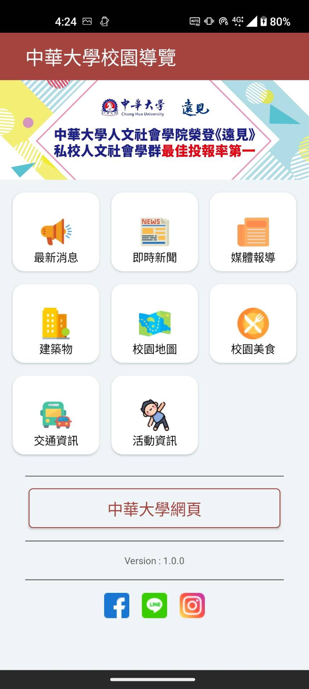

### 最新消息

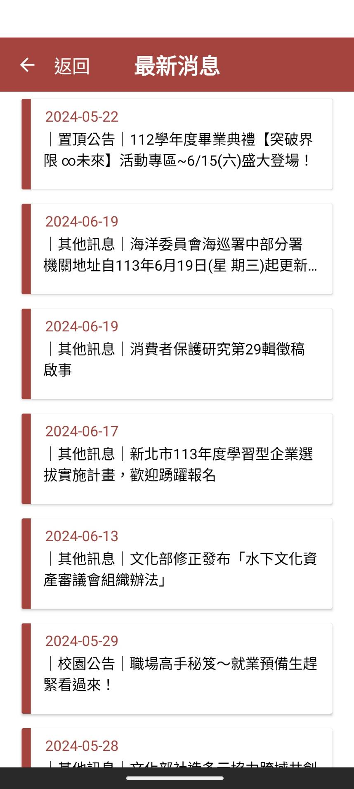

### 即時新聞

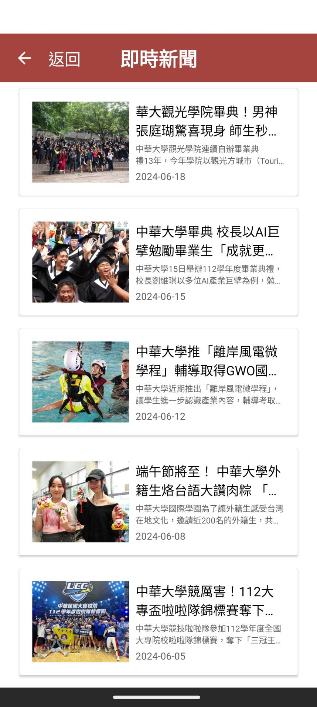

### 媒體報導

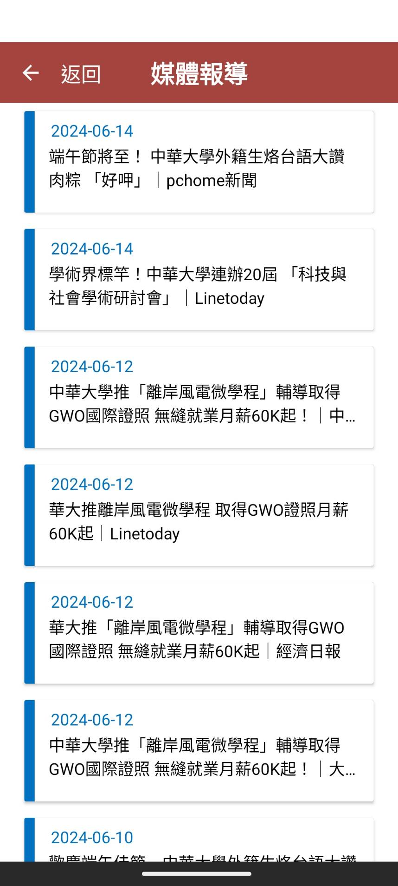

### 建築物

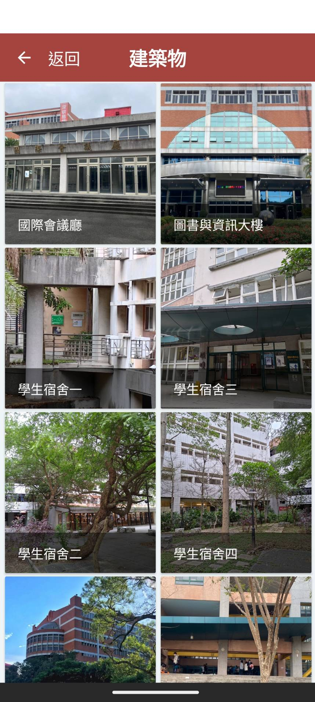
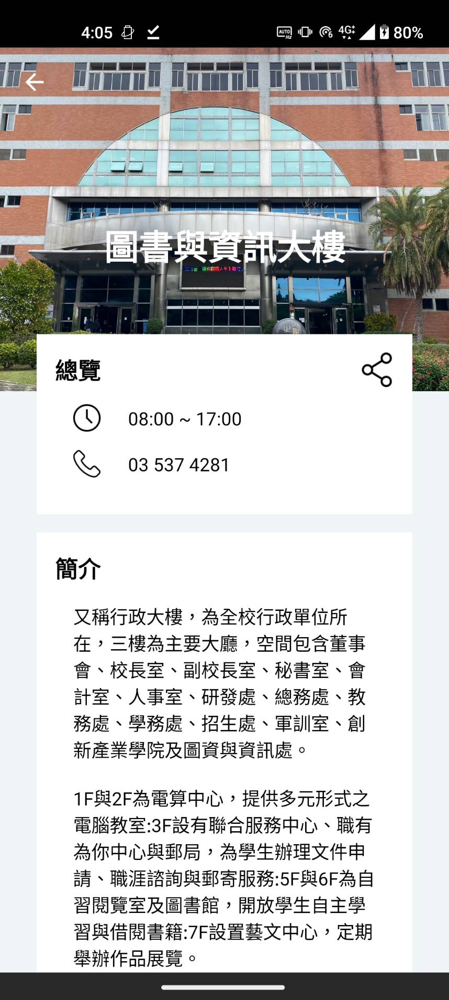

### 校園地圖

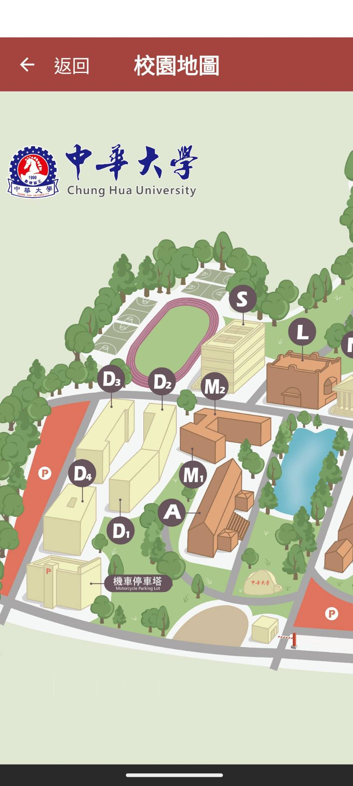

### 校園美食

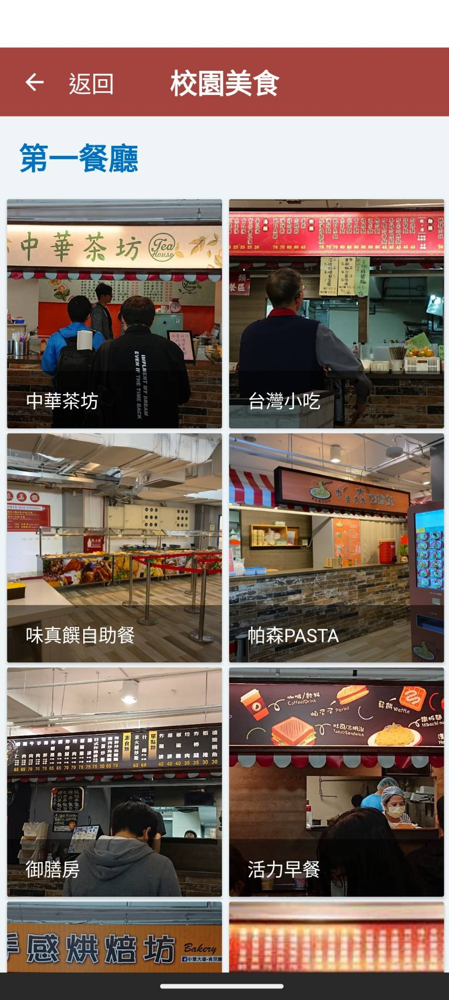
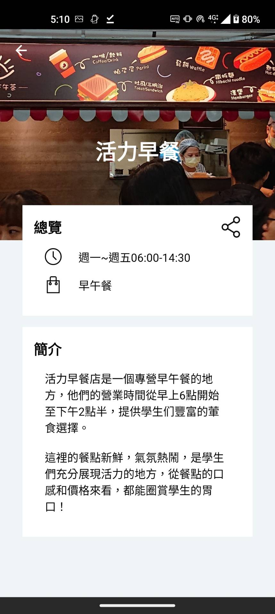

### 交通資訊

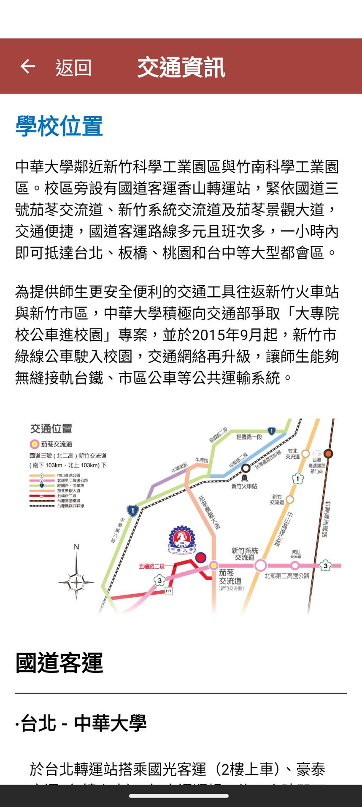

### 活動資訊

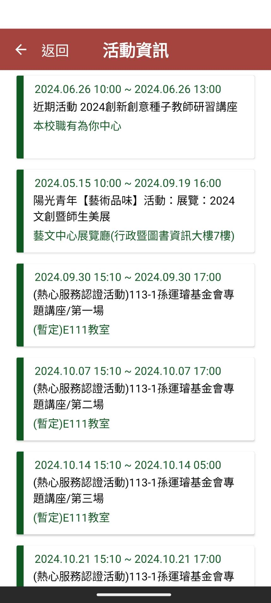
